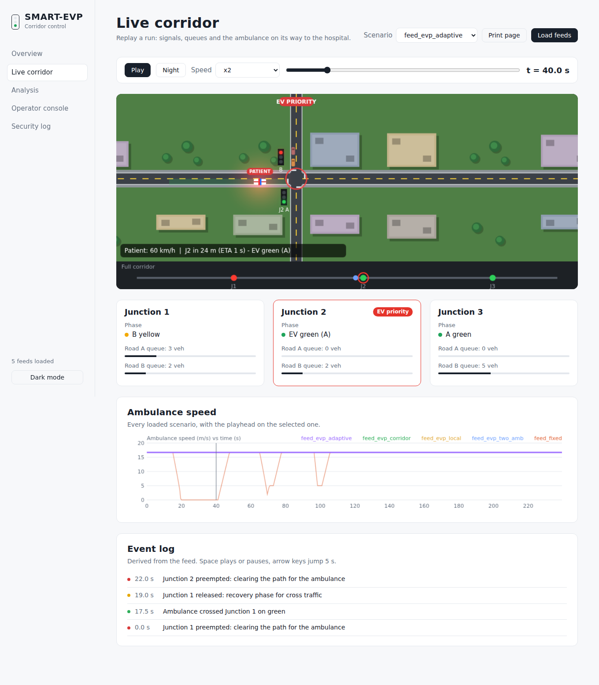

# SMART-EVP

Secure emergency-vehicle priority for a 3-junction traffic corridor. A MATLAB simulation plus a
web dashboard to replay runs and compare strategies.

An ambulance sends HMAC-signed position messages. Each junction verifies them (registered ID,
signature, freshness, replay), clears the road safely, then runs a queue-based recovery so cross
traffic is not left stuck.



## Features

- **Secure messaging:** HMAC-SHA256 signatures, ID registry, timestamp freshness and sequence-number replay protection.
- **Three strategies compared:** fixed-time signals, EVP with local radio range, EVP with corridor pre-notification.
- **Adaptive trigger:** a just-in-time, queue-aware option that starts preemption only when the junction needs it.
- **Two ambulances:** patient-first arbitration with a commit rule, so an ambulance about to cross is not cut off.
- **Safe by construction:** preemption never skips yellow or all-red. Safety counters (conflicting greens, illegal transitions, red-light runs) are checked in every test.
- **Verification:** 10 security unit tests and 18 fault-injection scenarios (attacks, packet loss, radio dropout, blocked exit, operator overrides).
- **Statistics:** Monte Carlo runs with 95% confidence intervals, paired seeds, and a traffic-volume sweep.
- **Dashboard:** replay the corridor, compare scenarios against fixed-time, view Monte Carlo charts, build operator override commands.

## Quick start

Requirements: MATLAB R2018b or newer. No toolboxes needed for the simulation.
(If `struct2array` errors on your install, replace `sum(struct2array(x))` with `sum(cell2mat(struct2cell(x)))`.)

```matlab
cd matlab
run_all          % tests, simulations, Monte Carlo, fault tests, JSON exports
```

Then open `dashboard/dashboard.html` in a browser, click **Load feeds**, and select all the `.json`
files that `run_all` wrote into the `matlab` folder.

Other entry points: `main`, `test_security`, `run_fault_tests(10)`, `demo_single_run`,
`demo_two_ambulances`, `run_two_ambulance_experiments(50)`, `run_volume_sweep(20)`.

## Results (50 Monte Carlo runs, mean +/- 95% CI, in simulation)

| Metric | Fixed-time | EVP local range | EVP corridor |
|---|---|---|---|
| Ambulance delay (s) | 28.1 +/- 6.5 | 3.1 +/- 0.9 | 1.8 +/- 0.7 |
| Ambulance stops | 1.1 +/- 0.3 | 0 | 0 |
| Cross-road delay (s) | 19.6 +/- 0.8 | 22.2 +/- 0.8 | 22.5 +/- 0.8 |
| Main-road delay (s) | 14.7 +/- 0.5 | 13.7 +/- 0.5 | 13.4 +/- 0.4 |

EVP removes almost all ambulance delay, and the cross-road cost is about 2.6 to 2.9 s per vehicle.
Local and corridor ranges overlap slightly, so the plot alone does not prove corridor is better than local.
Security: a replay attack run produced 19 rejected messages and 0 spoofed engagements.

## Operator override

```matlab
opts = struct('range','corridor','twoAmb',true, ...
              'operator',[struct('t',30,'junction',2,'cmd','cancel')]);
res = run_simulation(config_params(),'evp',7,opts);
export_feed(res,'feed_operator.json');
```

Commands: `cancel`, `force_A`, `force_B`, `release`. Signals still pass yellow and all-red.
The dashboard console only builds this command. It replays saved runs and cannot control a live simulation.

## How it works

The engine (`matlab/run_simulation.m`) steps every 0.5 s: traffic arrivals, queue discharge,
message sending, junction verification, release logic, arbitration, signal control, ambulance
physics. The same seed gives identical traffic in every strategy, so comparisons are paired.
A full walkthrough is in [docs/GUIDE.md](docs/GUIDE.md).

## Repository layout

```
matlab/      simulation engine, security, experiments, tests, exporters
dashboard/   dashboard.html (open in any modern browser)
docs/        GUIDE.md, a complete explanation of the project
```

## Limitations

- Simplified traffic: two-phase signals, random arrivals, one lane per approach, not calibrated against real data or compared with SUMO or field data.
- One patient ambulance, plus at most one empty ambulance on one cross road.
- The patient check is a simulated priority registry, not sensor detection.
- Security uses shared symmetric **demo keys** in `config_params.m`, with no key rotation or hardware protection. It does not cover jamming, a compromised ambulance unit or a compromised controller.
- Ambulance delay falls with EVP but cross-road delay rises, so both are reported.
- Results are from simulation only. Claims hold "in this simulation", not in the real world.
- No hardware, MQTT or e-mail alerts are implemented.

## Author

Angelo Kwame Amoateng, BSc Computer Engineering, KNUST.
[Portfolio](https://kwamegelo.web.app) | [GitHub](https://github.com/kwamegelo)

## License

MIT, see [LICENSE](LICENSE).
